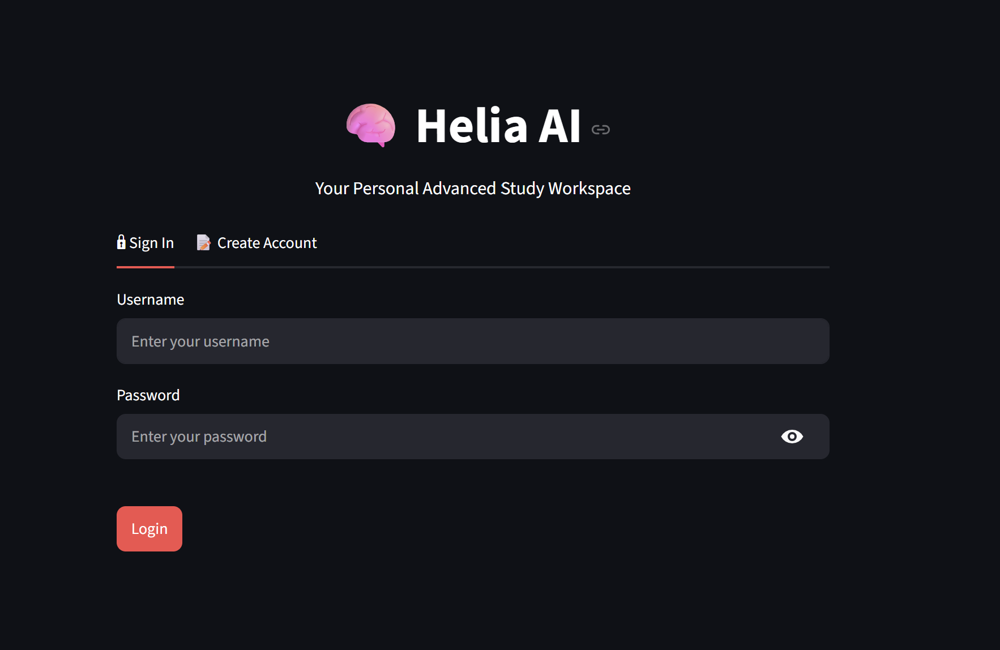
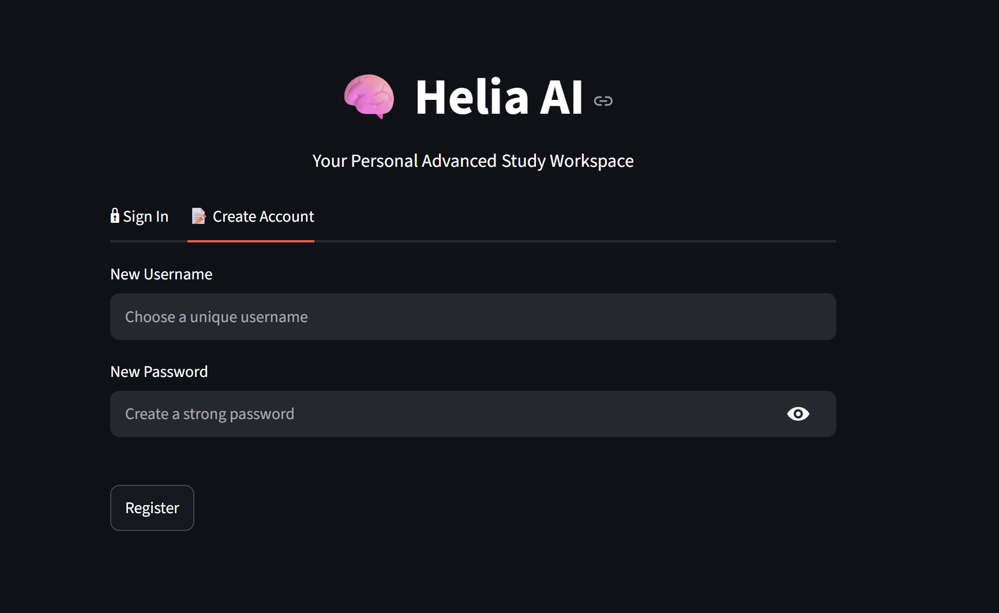
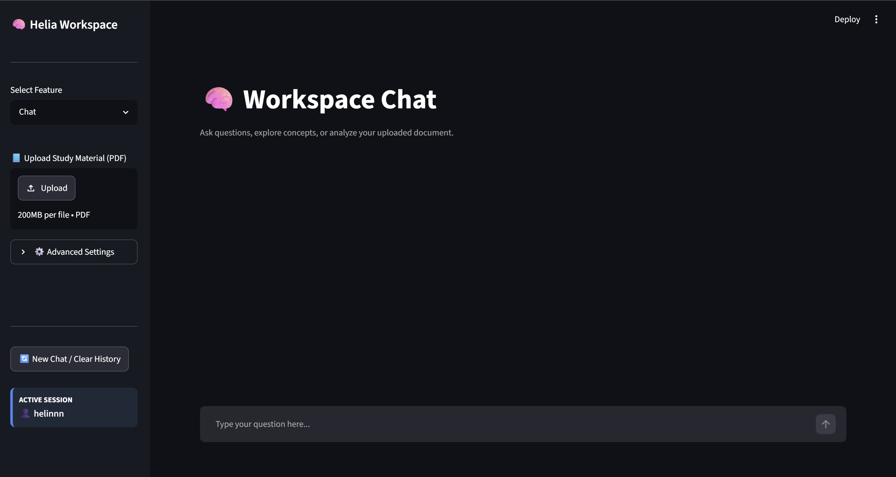
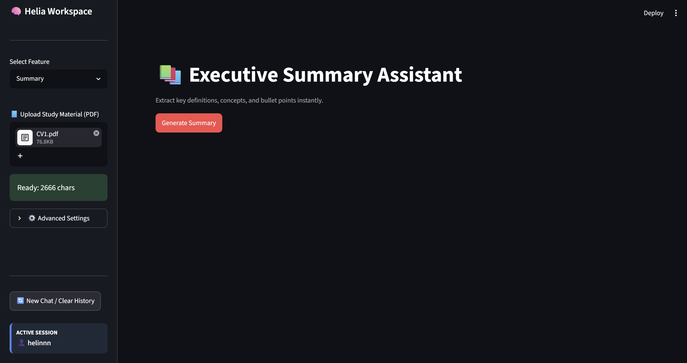
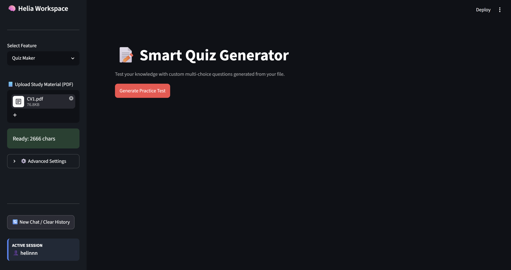
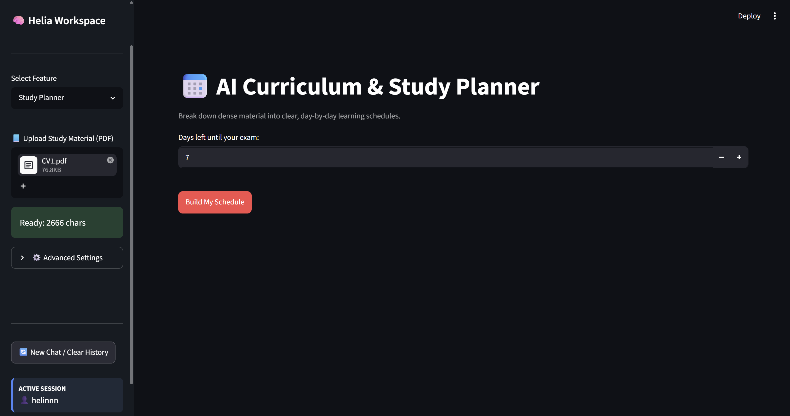

# 🧠 Helia AI

Helia AI is an AI-powered study assistant built with Streamlit and Ollama.

## 🚀 Features

* 🔐 User authentication (login/register)
* 💬 AI chat with multiple models (Llama3, Phi-3, Mistral)
* 📚 PDF upload and text extraction
* 📝 AI-powered summaries
* 🧠 Quiz generation from study materials
* 📅 Study planner based on exam days
* 💾 SQLite-based chat history
* 🌙 Modern dark UI design

## 🛠 Tech Stack

* Python
* Streamlit
* Ollama (local LLMs)
* SQLite
* PyPDF2

## 🤖 AI Models Used

* Llama 3 (chat)
* Phi-3 (summary/planning)
* Mistral (quiz generation)

## 📦 Installation

```bash
pip install -r requirements.txt
streamlit run main.py
```

## 📸 Screenshots

## Login Screen



### Chat Screen


### Summary Screen


### Quiz Screen


### Study Planner


## 📌 Future Improvements

* RAG (Retrieval-Augmented Generation)
* Voice assistant integration
* Web search support
* Memory system
* Flashcard generator

## 👤 Author

Built as a hands-on AI learning project.
